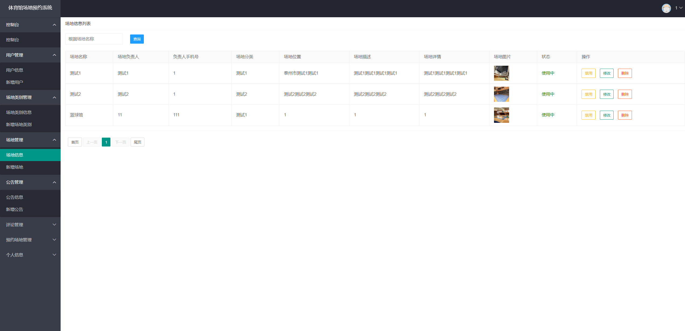
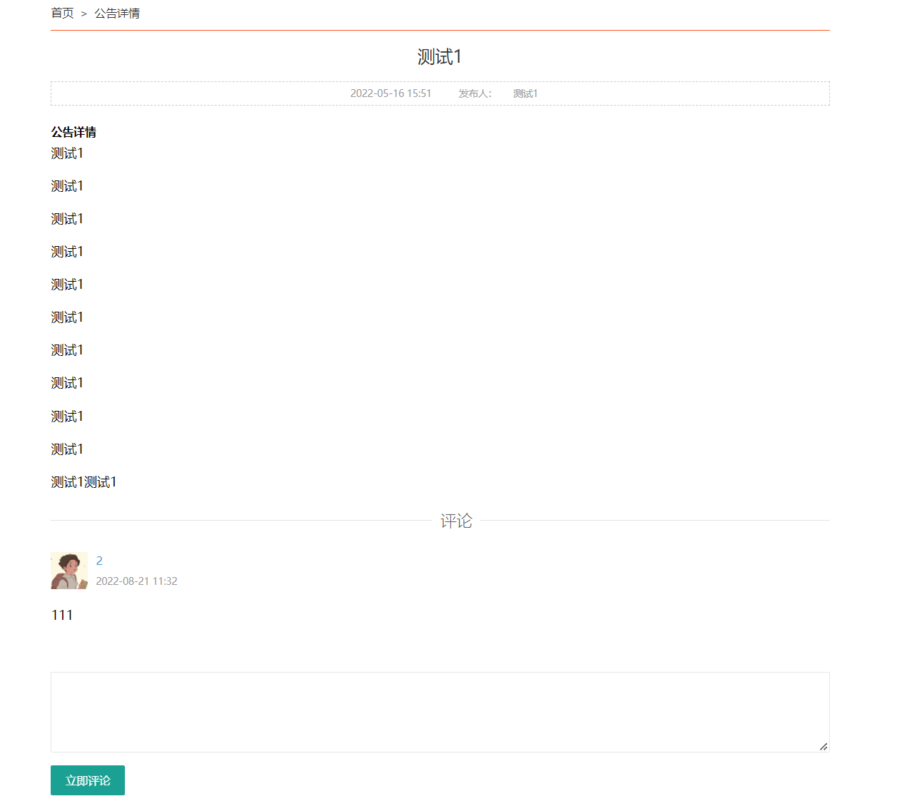
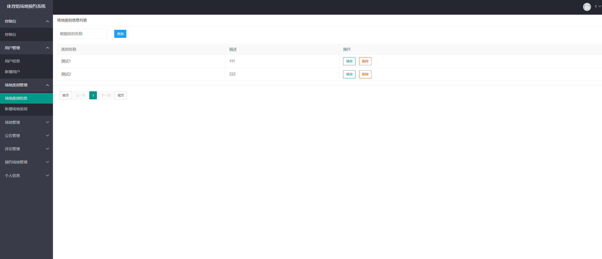
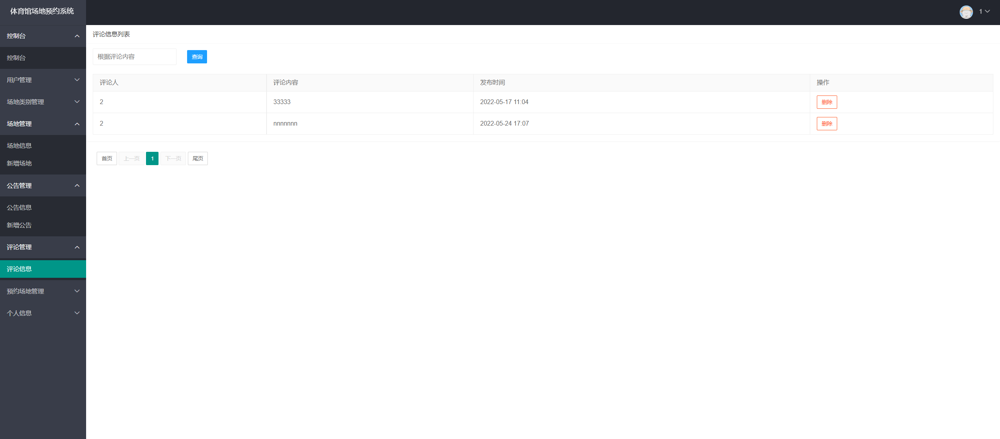
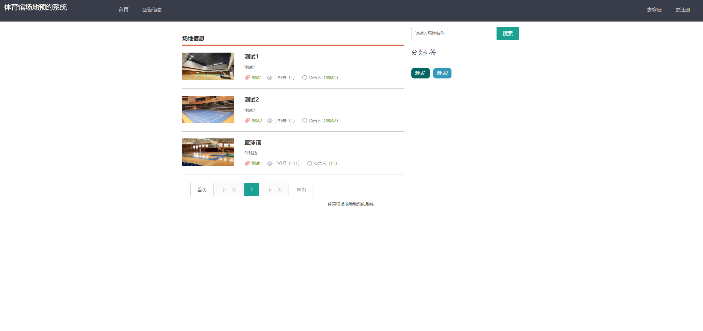
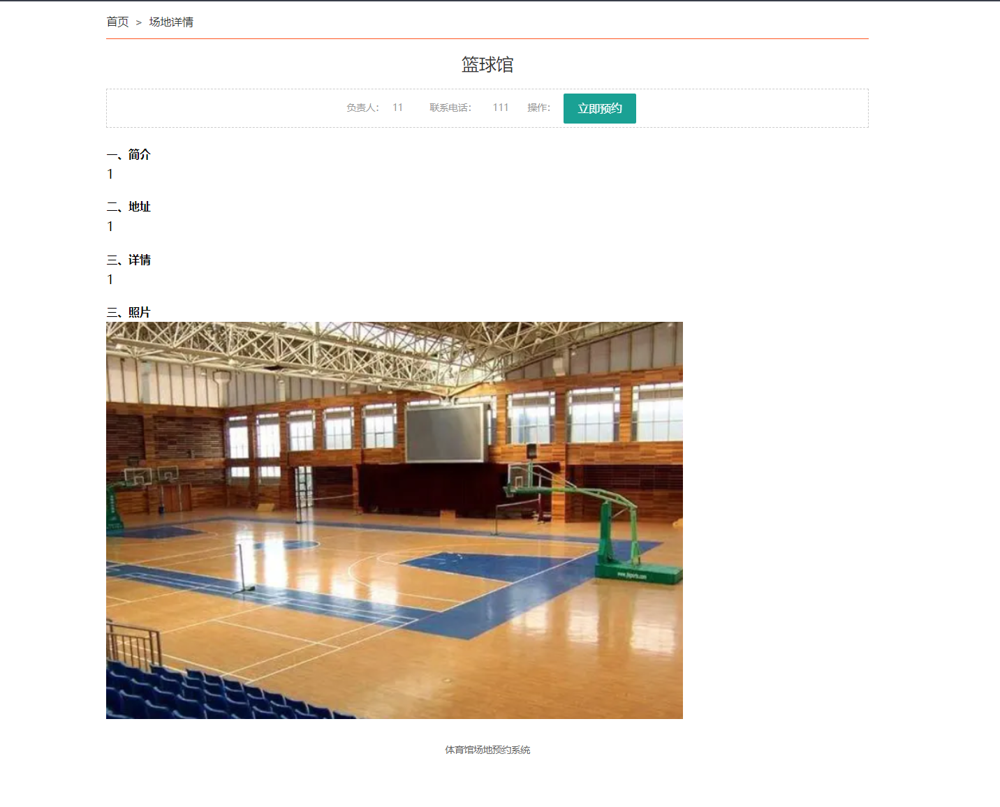
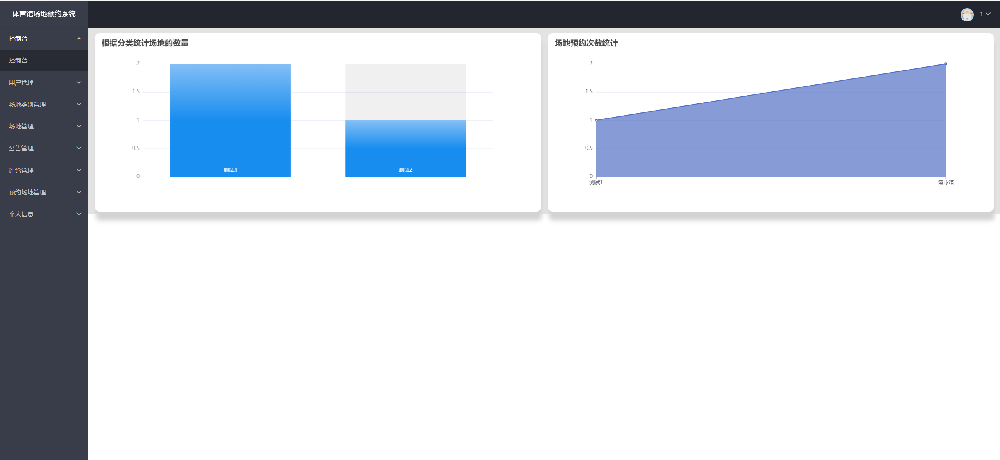
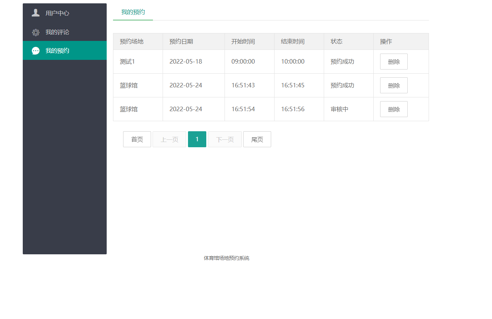
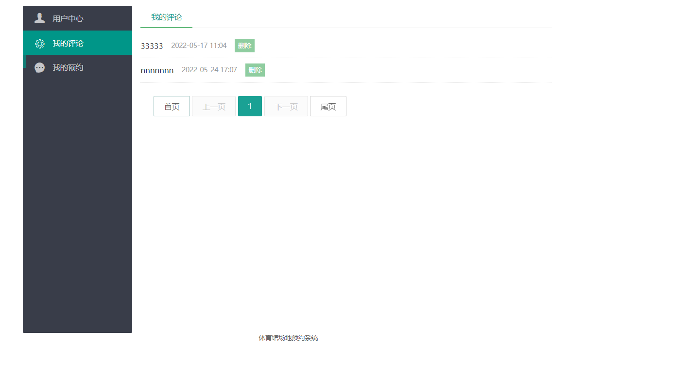

## 基于Springboot的体育馆场地预约系统

- <b>完整代码获取地址：从戎源码网 ([https://armycodes.com/](https://armycodes.com/))</b>
- <b>技术探讨、资料分享，请加QQ群：692619798</b> 
- <b>作者微信：19941326836  QQ：952045282</b> 
- <b>承接计算机毕业设计、Java毕业设计、Python毕业设计、深度学习、机器学习</b>
- <b>选题+开题报告+任务书+程序定制+安装调试+论文+答辩ppt 一条龙服务</b>
- <b>所有选题地址 ([https://github.com/YuLin-Coder/AllProjectCatalog](https://github.com/YuLin-Coder/AllProjectCatalog)) </b>

## 项目介绍
基于Springboot的体育馆场地预约系统，包含两种角色：管理员、用户,系统分为前台和后台两大模块，主要功能如下。

### 【管理员】:
1. 控制台：管理员登录后可以进入系统的控制台，查看系统的整体情况和统计数据。
2. 用户管理：管理员可以管理用户信息，包括查看、编辑、删除等操作。
3. 场地类别管理：管理员可以管理场地类别，包括查看、编辑、删除等操作。
4. 场地管理：管理员可以管理具体的场地，包括查看、编辑、删除等操作。
5. 公告管理：管理员可以管理系统的公告信息，包括发布、编辑、删除等操作。
6. 评论管理：管理员可以管理用户的评论，包括查看、删除等操作。
7. 预约场地管理：管理员可以管理用户的场地预约，包括查看、审核、取消等操作。

### 【用户】:
1. 用户中心：用户可以管理自己的个人信息，包括查看、编辑等操作。
2. 我的评论：用户可以查看和管理自己的评论，包括查看、编辑、删除等操作。
3. 我的预约：用户可以查看和管理自己的场地预约信息，包括查看、取消等操作。

## 项目技术
- 编程语言：Java
- 数据库：MySQL
- 项目管理工具：Maven
- 前端技术：Jquery、Bootstrap、Layui、ECharts
- 后端技术：Spring、SpringMVC、MyBatis

## 运行环境
- JDK版本：JDK1.8及以上
- 开发工具：IDEA、Ecplise、Myecplise都可以
- 数据库: MySQL5.7及以上
- Maven：maven3.0及以上

## 运行截图

